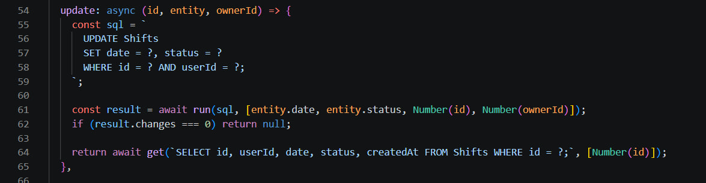
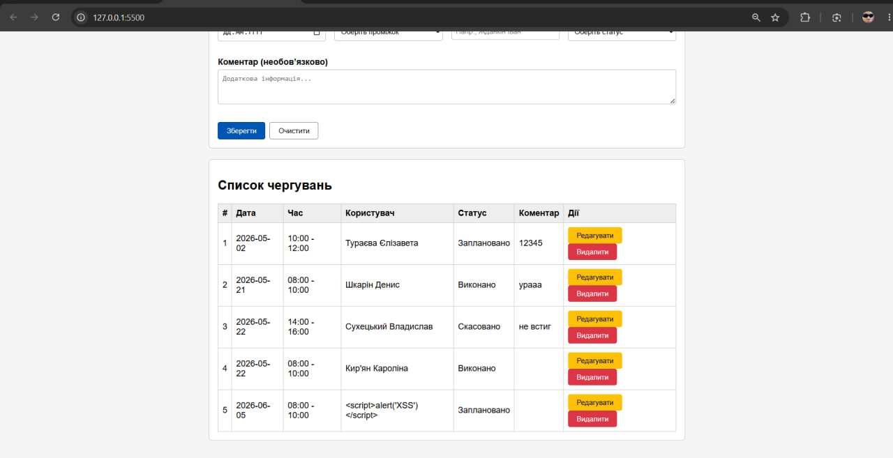
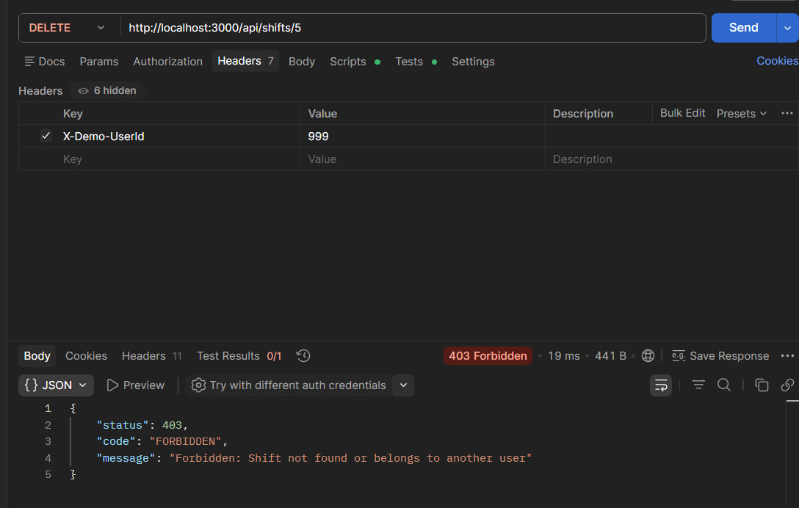
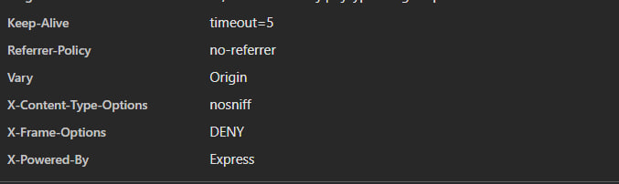

 Звіт з лабораторної роботи №5
**Тема:** Уразливості і захист вебзастосунків

## Зведена таблиця ризиків

| Уразливість | Ризик | Наслідок | Виправлення |
| :--- | :--- | :--- | :--- |
| **XSS** (DOM-based) | Високий | Зловмисник може вставити шкідливий JS/HTML код через поле коментаря чи імені, який виконається у браузері інших користувачів. | Повна відмова від `innerHTML` для вхідних даних користувача, використання безпечного DOM API (`textContent`). |
| **SQL Injection** | Критичний | Можливість маніпулювати SQL-запитом через неперевірені параметри, що може призвести до витоку бази даних, авторизації під іншим користувачем або її знищення. | Перехід від конкатенації рядків до параметризованих SQL-запитів із використанням знаків питання (`?`) та масиву значень. |
| **IDOR** (Broken Access) | Високий | Користувач може читати, редагувати або видаляти чужі чергування/заявки, підставивши інший `id` у URL-адресу. | Додано `demoAuth` middleware, реалізовано сувору перевірку `userId` (власника ресурсу) на рівні бази даних для ВСІХ операцій (GET, PUT, DELETE). |
| **Security Misconfiguration** | Середній | Витік внутрішньої інформації сервера (детальних стек-трейсів), відсутність захисту від clickjacking, сніфінгу та занадто відкрита політика CORS. | Додано безпечні HTTP-заголовки, обмежено CORS суворим списком Origins та приховано внутрішні деталі помилок для production-середовища. |

---

## Сценарій А – SQL Injection (SQLi)
* **Де саме в проекті:** `src/repositories/shifts.repository.js` та `src/repositories/swapRequests.repository.js`.
* **Як проявлялося:** SQL-запити формувалися шляхом прямого склеювання рядків із параметрами від користувача. Будь-який неперевірений ввід міг повністю змінити логіку виконання запиту.
* **Що змінено:** Усі запити переписано на параметризовані. Замість підстановки змінних використовуються плейсхолдери `?`, а самі дані передаються окремим масивом параметрів через `run()`, `all()` або `get()`. Для безпечного сортування впроваджено Allowlist (білий список дозволених полів).
* **Як перевірено:** Будь-який ввід спецсимволів (наприклад, лапок або коментарів `--`) тепер сприймається драйвером SQLite виключно як звичайний рядок (текстове значення) і більше не ламає синтаксис SQL-коду.

---

## Сценарій Б – XSS (Stored)
* **Де саме в проекті:** `src/ui.js` (фронтенд, функція відображення даних `renderTable`).
* **Як проявлялося:** Дані, які вводив користувач (зокрема коментарі), вставлялися в HTML-структуру таблиці через властивість `innerHTML`. Це давало змогу зловмиснику впровадити та виконати довільний JavaScript-код у браузерах інших відвідувачів сторінки.
* **Що змінено:** Повністю прибрано використання `innerHTML` для виведення динамічних даних. Створення елементів таблиці переведено на безпечне використання `document.createElement()`, а безпосередній запис тексту здійснюється через безпечну властивість `textContent`.
* **Як перевірено:** При спробі додати чергування зі шкідливим кодом ``, рядок успішно зберігається в базі, але на фронтенді відображається як звичайний безпечний текст. Браузер більше не інтерпретує його як активний скрипт.

---

## Сценарій В – Broken Access Control / IDOR
* **Де саме в проекті:** `src/middleware/auth.middleware.js`, `src/controllers/shifts.controller.js`, `src/services/shifts.service.js` та репозиторій.
* **Як проявлялося:** Система не перевіряла права власності на записи. Зловмисник міг підставити будь-який чужий `id` у URL запиту (`/api/shifts/:id`) і безперешкодно прочитати, змінити або повністю видалити чуже чергування.
* **Що змінено:** Реалізовано middleware `demoAuth`, яке зчитує ідентифікатор поточного користувача із HTTP-заголовка `X-Demo-UserId`. Логіку контролерів, сервісів та запитів до БД оновлено: тепер під час виклику методів читання, оновлення чи видалення обов'язково передається та перевіряється `ownerId` користувача. На спроби доступу до чужих даних сервер відповідає помилкою безпеки.
* **Як перевірено:** Надсилання запиту через інструмент Postman (наприклад, спроба відправити запит `DELETE` на чужий запис від імені неавторизованого або іншого користувача) призводить до негайного блокування запиту з боку сервера та повернення HTTP-статусу `403 Forbidden`.

---

## Сценарій Г – Security Misconfiguration
* **Де саме в проекті:** `src/index.js` та `src/middleware/error.middleware.js`.
* **Як проявлялося:** Сервер віддавав занадто детальні повідомлення про помилки разом зі стек-трейсом (`stack trace`) у відповідях клієнту. Також були відсутні базові заголовки захисту та використовувалася занадто відкрита політика CORS (`*`).
* **Що змінено:** Налаштовано суворий CORS, що дозволяє запити лише з конкретних локальних адрес фронтенду. Додано глобальне middleware, яке встановлює захисні HTTP-заголовки: `X-Content-Type-Options: nosniff` (захист від MIME-сніфінгу), `X-Frame-Options: DENY` (захист від Clickjacking) та `Referrer-Policy: no-referrer`. У файлі `error.middleware.js` додано перевірку середовища (`process.env.NODE_ENV`): у режимі production детальні помилки повністю приховуються, а клієнту повертається загальне безпечне повідомлення.
* **Як перевірено:** За допомогою вкладки Network у інструментах розробника браузера (DevTools) перевірено HTTP-відповіді сервера — усі захисні заголовки успішно додаються до кожного запиту, а внутрішня архітектура застосунку більше не розкривається при виникненні виняткових ситуацій.

